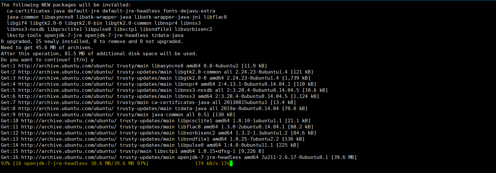

# Bamboo 설치하기
* * *
Bamboo를 설치하는 방법에 대해 알아보겠습니다.

## 리눅스에서 설치하기
1-1. 공식 홈페이지에서 Bamboo 설치 파일 다운로드   
Bamboo 설치 파일은 https://www.atlassian.com/ko/software/bamboo/download 링크에서 다운로드 가능합니다. 가이드에서는 리눅스에서 설치할 것이기 때문에 tar.gz archive 버전을 사용하였습니다.   

1-2. 다운로드한 파일 압축 해제   
압축 해제 명령을 사용하여 파일을 압축 해제합니다.
- 명령어
    ``` bash
    # tar -xvf <다운로드 파일명>
    tar -xvf atlassian-bamboo-7.0.3.tar.gz
    ```
1-3. 압축 해제 후, 폴더 이동
정상적으로 압축 해제가 진행되었으면, 새로 생성된 폴더를 확인할 수 있습니다. 폴더로 이동하겠습니다.

- 명령어
    ``` bash
    cd atlassian-bamboo-7.0.3
    ```
1-4. Bamboo 실행하기
Bamboo 실행 방법은 ./bin/ 폴더에 들어있는 스크립트를 실행해주면 됩니다. ./bin/ 폴더 내에는 여러 동작을 하는 스크립트가 들어있습니다.
- 명령어
    ``` bash
    # Bamboo 서비스 실행
    ./bin/start-bamboo.sh
    ```
- JRE 설치가 되어있지 않아 실행되지 않을 때

Bamboo는 JAVA를 사용하여 동작하기 때문에 JDK 혹은 JRE가 기본으로 설치되어 있어야 합니다. 위와 같은 오류가 발생했을 경우 아래 명령어를 실행하여 설치를 진행합니다.
``` bash
sudo apt-get install default-jre
```

설치가 모두 종료되었으면 다시 스크립트를 실행해보겠습니다.

