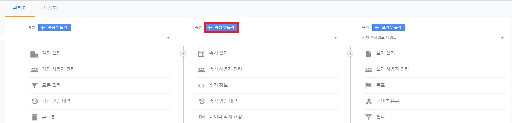

# 1. Getting Started
Vuetify를 Electron에 적용하는 방법에 대해 알아봅니다.
<br/>

# 2. Google Analytics 추가하기
- Google Analytics의 속성을 추가하기 위해 좌측 하단의 관리 버튼을 눌러주세요
  
- <b>속성 만들기</b> 버튼 클릭
  
- 속성 선택하기
  
- 속성 설정하기
  Google Analytics를 설정하기 위한 웹 페이지 이름과 주소를 입력해주세요
  
  
# 2. 설정 방법
- 관련 플러그인 설치하기
  - yarn 설치 방법
    ``` bash
    yarn add gatsby-plugin-google-analytics
    ```
  - yarn 설치 결과
    

- gatsby-config.js에 플러그인 추가하기
  - 플러그인 추가 방법 (gatsby-config.js)
    ``` javascript
    const plugins = [
    {
      resolve: 'gatsby-plubin-analytics'
    },
    'gatsby-plugin-sitemap',
    'gatsby-plugin-sharp',
    ```
  - 추가 캡처
    

- src/analytics.js 새로운 파일 추가하기
**1-1. vuetify 모듈 설치 후, 적용**
  - 설치 명령어
    ``` bash
    ## npm
    yarn add vuetify
    ```
  - 설치 결과
    
<br/>

**1-2. 모듈 적용 방법**
- 프로젝트의 src/render/index.js에 vuetify 모듈을 import 해주면 사용가능하다.
- src/render/index.js
  ``` javascript
  import App from './App'
  import router from './router'
  import store from './store'
  /// 아래 추가 //////////////////////
  import Vuetify from 'vuetify'
  import 'vuetify/dist/vuetify.min.css'

  Vue.use(Vuetify)
  /////////////////////////////////
  if (!process.env.IS_WEB) Vue.use(require('vue-electron'))
  Vue.http = Vue.prototype.$http = axios
  Vue.config.productionTip = false
  ```

# 2. Vuetify 컴포넌트 사용하기

**2-1. 소스 수정**   
- vuetify 컴포넌트 중의 하나인 버튼을 테스트 해보려고 한다.  
- src/render/compomnents/SystemInformaion.vue 파일을 열어서 모두 내용을 지우고 아래 내용을 추가한다.
  ``` javascript
  <template>
    <v-row align="center">
      <v-col class="text-center" cols="12" sm="4">
        <div class="my-2">
          <v-btn depressed small>Normal</v-btn>
        </div>
        <div class="my-2">
          <v-btn depressed small color="primary">Primary</v-btn>
        </div>
        <div class="my-2">
          <v-btn depressed small color="error">Error</v-btn>
        </div>
        <div class="my-2">
          <v-btn depressed small disabled>Disabled</v-btn>
        </div>
      </v-col>

      <v-col class="text-center" cols="12" sm="4">
        <div class="my-2">
          <v-btn depressed>Normal</v-btn>
        </div>
        <div class="my-2">
          <v-btn depressed color="primary">Primary</v-btn>
        </div>
        <div class="my-2">
          <v-btn depressed color="error">Error</v-btn>
        </div>
        <div class="my-2">
          <v-btn depressed disabled>Disabled</v-btn>
        </div>
      </v-col>

      <v-col class="text-center" cols="12" sm="4">
        <div class="my-2">
          <v-btn depressed large>Normal</v-btn>
        </div>
        <div class="my-2">
          <v-btn depressed large color="primary">Primary</v-btn>
        </div>
        <div class="my-2">
          <v-btn depressed large color="error">Error</v-btn>
        </div>
        <div class="my-2">
          <v-btn depressed large disabled>Disabled</v-btn>
        </div>
      </v-col>
    </v-row>
  </template>

  <script>
    export default {
      data () {
        return {
          electron: process.versions.electron,
          name: this.$route.name,
          node: process.versions.node,
          path: this.$route.path,
          platform: require('os').platform(),
          vue: require('vue/package.json').version
        }
      }
    }
  </script>

  <style scoped>
    .title {
      color: #888;
      font-size: 18px;
      font-weight: initial;
      letter-spacing: .25px;
      margin-top: 10px;
    }

    .items { margin-top: 8px; }

    .item {
      display: flex;
      margin-bottom: 6px;
    }

    .item .name {
      color: #6a6a6a;
      margin-right: 6px;
    }

    .item .value {
      color: #35495e;
      font-weight: bold;
    }
  </style>
  ```
<br/>

**2-2. 실행**   
결과를 확인해보기 위해 프로젝트를 실행해보겠습니다.
  ``` bash
  yarn run dev
  ```

<br/>

**2-3. 실행 결과**   
