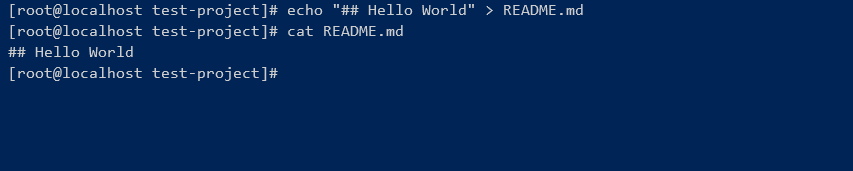
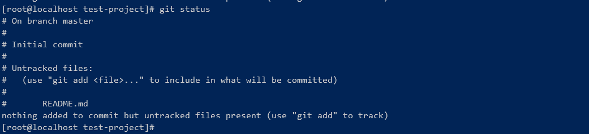
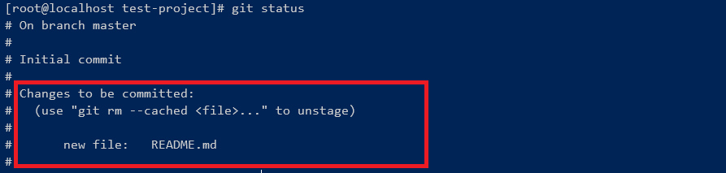
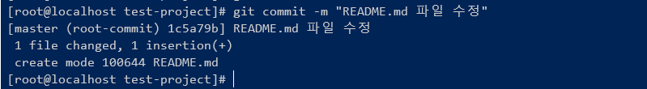
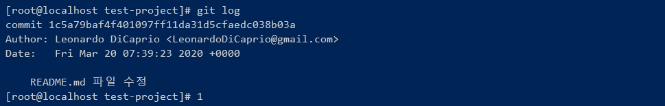

# 1. Getting Started
Git을 이용한 프로젝트 시작하는 방법에 대해 정리되어 있습니다.

<br/>
<br/>

# 2. Git 프로젝트 만들기
- Git 테스트 프로젝트 작업을 위해 폴더를 생성 후, 폴더로 이동합니다.

``` bash
## 폴더 생성
mkdir test-project
## 폴더 이동
cd test-project
```

<br/>

- 생성한 폴더에서 Git을 시작하기 위해 init 명령을 실행합니다.
``` bash
git init
```

- 파일 추가 후, 커밋하기
  - README.md 파일을 추가 후, 저장합니다. (내용은 임의로 작성해도 됩니다.)
  ``` bash
  echo "## Hello World" > README.md
  ```
  
  - git status 명령 실행해보기
    git status는 사용 중인 프로젝트의 git 상태를 확인해 볼 수 있는 명령어입니다.
    ``` bash
    git status
    ```
    현재 프로젝트에서 README.md 파일을 새로 생성하였기 때문에, README.md 파일이 Untracked Files 상태로 남아있습니다.
    

  - untracked file을 stage로 등록하기
  Commit 하기 위해서는 먼저 Untracked File을 Stage로 등록해야됩니다. Stage로 등록하기 위해서는 git add 명령어를 사용하면 됩니다. 앞서 작성한 README.md 파일을 Stage로 등록해보겠습니다.
    ``` bash
    git add README.md
    ```
  - git status로 현재 상태 확인해보기
    ``` bash
    git status
    ```
    

  - 커밋하기
    git 커밋할 때는 메시지와 함께 남겨주면 됩니다. 아래와 같이 한번 시도해보세요!
    ``` bash
    ## git commit -m "<수정 메시지>"
    git commit -m "README.md 수정"
    ```
    


  -  커밋 후, 상태 확인하기
    git 이전에 등록한 커밋의 히스토리를 확인하기 위해서 git log 명령어를 사용할 수 있습니다. 
    ``` bash
    git log
    ```
    