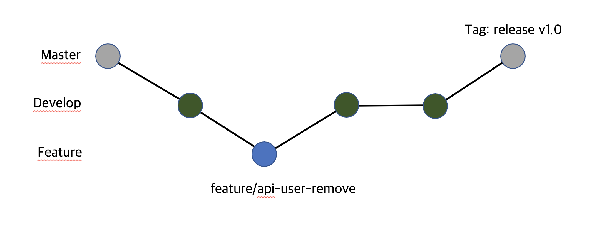
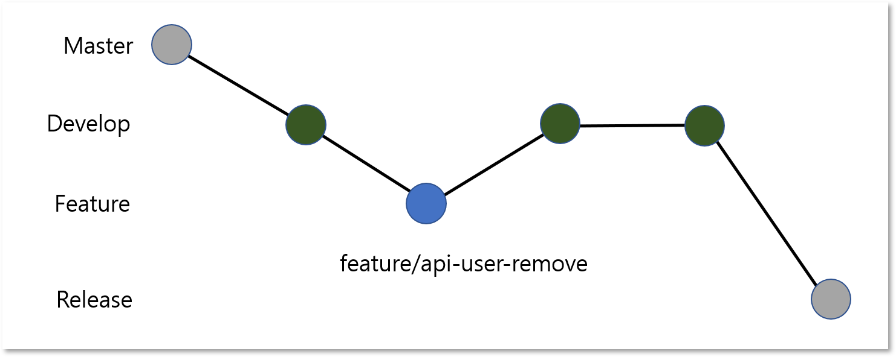
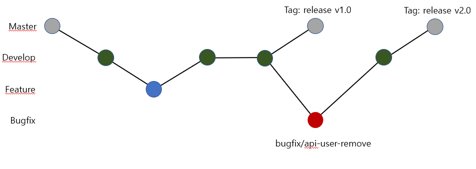
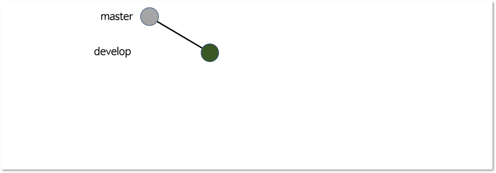
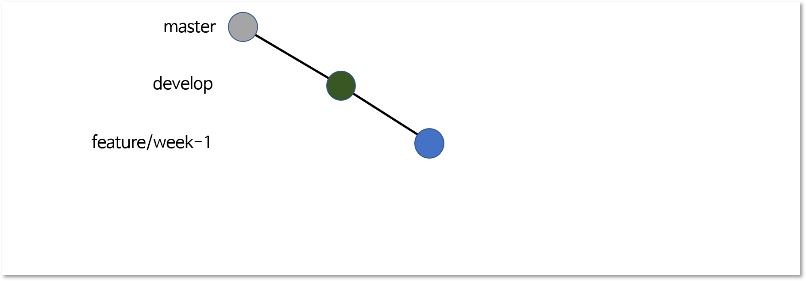
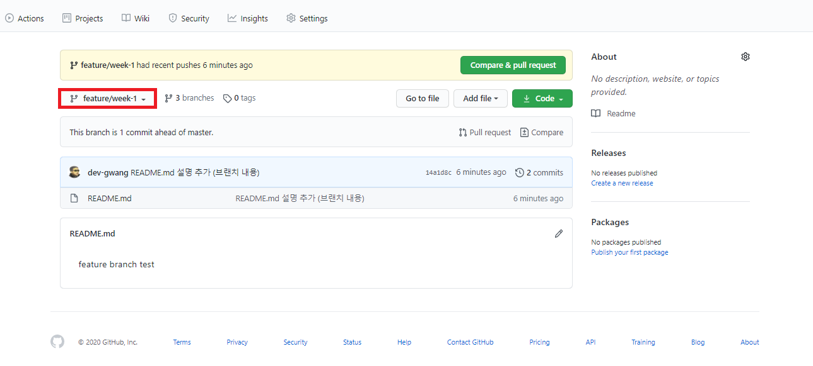
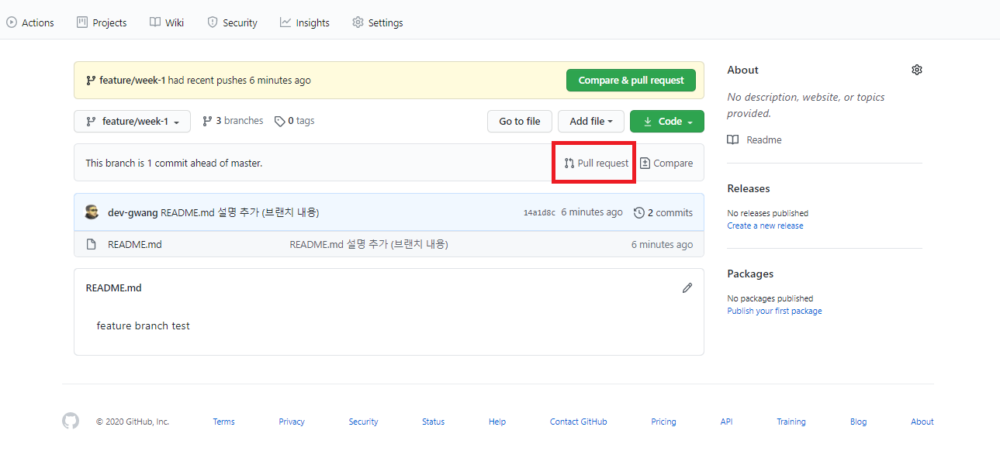
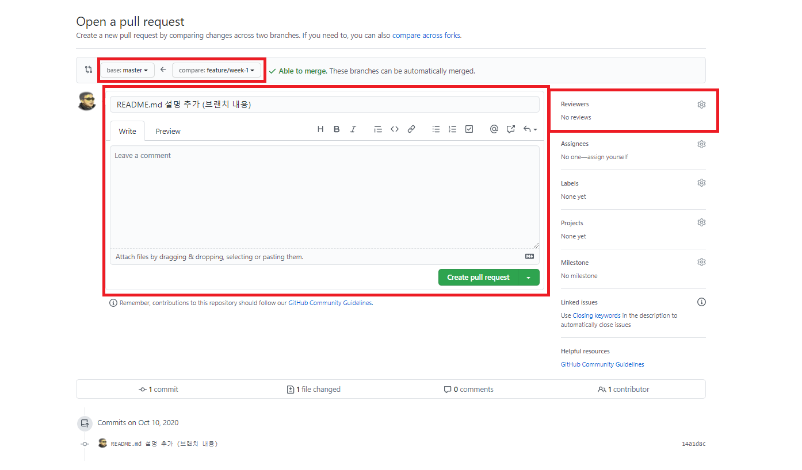
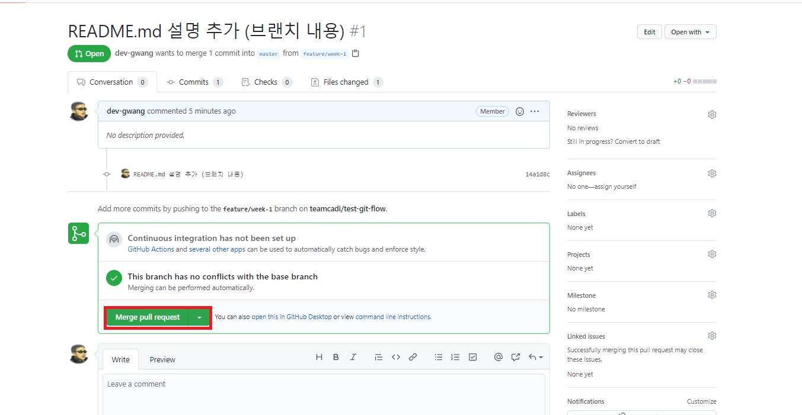
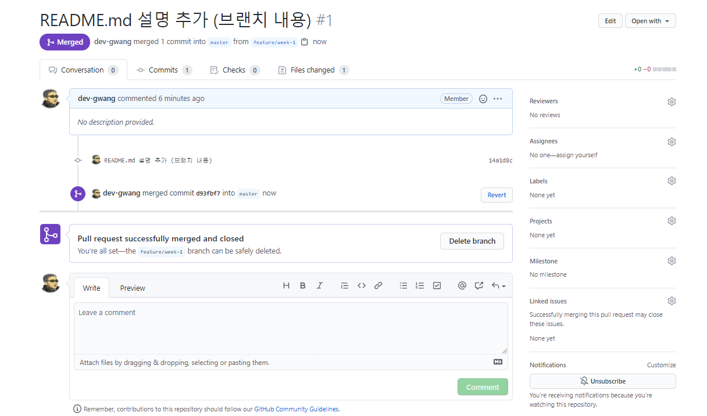

# 1. Getting Started
Git Flow에 대해 정리되어 있습니다.
<br/>
<br/>

# 2. Git Flow 이란
- GitFlow는 Vincent Driessen 이라는 개발자가 처음 제시한 Git 기반 협업 Flow입니다. 
- Git Branch를 사용하여 프로젝트의 규모가 클수록 Git WorkFlow를 사용하여 적용을 하고 있으며 더 나아가 CI/CD와 같은 도구에서도 이를 사용하고 있습니다.
  - 릴리즈 주기가 정해져있는 프로젝트에 이상적으로 사용
  - 그림 (출처 : https://www.atlassian.com/git/tutorials/comparing-workflows/gitflow-workflow#:~:text=Gitflow%20Workflow%20is%20a%20Git,designed%20around%20the%20project%20release.&text=In%20addition%20to%20feature%20branches,%2C%20maintaining%2C%20and%20recording%20releases.)
    

  
- 작동 원리
  - GitFlow는 Branch 분기 단위로 이루어지며 GitFlow의 필수 Branch는 아래와 같습니다.
    - 브랜치 명   

      |브랜치 이름|내용|비고|
      |---|---------------------|-----|
      |master|Git 저장소 기본 브랜치|-|
      |develop|개발 브랜치|-|
      |release|릴리즈 브랜치|사용할 떄도 있고 안할때도 있음|
      |feature|기능 개발 브랜치|-|
      |bugfix|버그 수정 브랜치|-|

    <br/>
    
    - 브랜치 명 규칙
      - master, develop 및 release 브랜치는 고정된 이름으로 사용하면 됩니다. 
      - feature와 bugfix 브랜치는 필요시 맞는 이름을 사용하여 구성하면 됩니다.
        - 예시
          - feature/user-api-remove
          - bugfix/ISSUE-001
  
  <br/>
  
  - Git Flow 예시
    - User 삭제 API 기능을 추가할 때 (feature/api-user-remove 브랜치)
      - Release 브랜치를 사용하지 않을 때
        
      - Release 브랜치를 사용할 때
        
    - User 삭제 API 기능에 버그가 있을 때 (bugfix/api-user-remove 브랜치)
        

<br/>

# 3. Git Flow 적용 순서
  - develop 브랜치 checkout
    ``` bash
    git checkout develop
    ```
    

  - 첫번째 주 개발 작업하기 위해 새로운 feature 브랜치 생성 후, checkout 하기
    ``` bash
    ## feature 브랜치 생성
    git branch feature/week-1
    ## feature 브랜치 이동
    git checkout feature/week-1
    ```
    

  - feature 브랜치에서 작업하기
    ``` bash
    ## 파일 내용 작업
    echo "feature branch test" > README.md
    ```

  - feature 브랜치 푸시
    ``` bash
    git push origin feature/week-1
    ```

  - feature 푸쉬한 커밋을 develop 브랜치로 Pull Request 하기
    - git 저장소 웹 페이지로 이동하여 feature 브랜치로 이동하기
    
    - Pull Request 클릭
    
    - 필요한 Pull Request 정보를 입력해주세요
    
      - Merge 될 브랜치 수정하기
        - master 브랜치에서 develop 브랜치로 변경
      - Reviewer 수정하기
        - 필요한 Reviewer 추가하기
      - Create pull request 버튼 클릭
    
  - Reviewer가 승인을 하면 Merge 가능
    

  - Merge이 성공되면 develop 브랜치로 merge 됩니다.
    


# 4. Git Flow 협업시 지켜야할 것
  - 공동으로 사용하는 Branch는 force commit은 절대로 사용하면 안 됩니다.