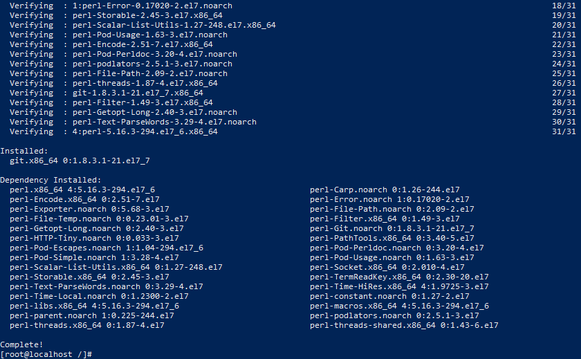
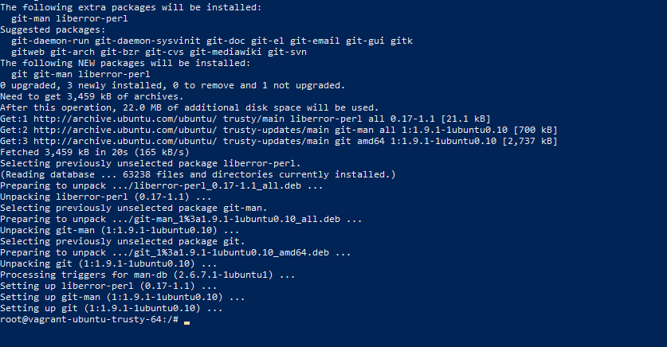
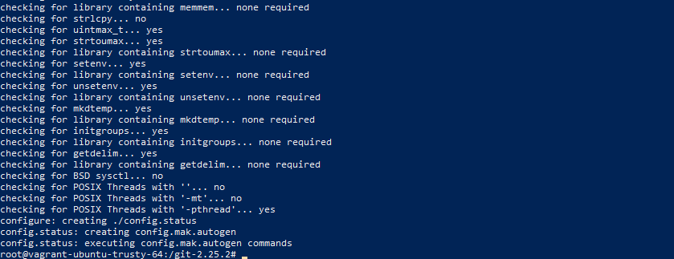
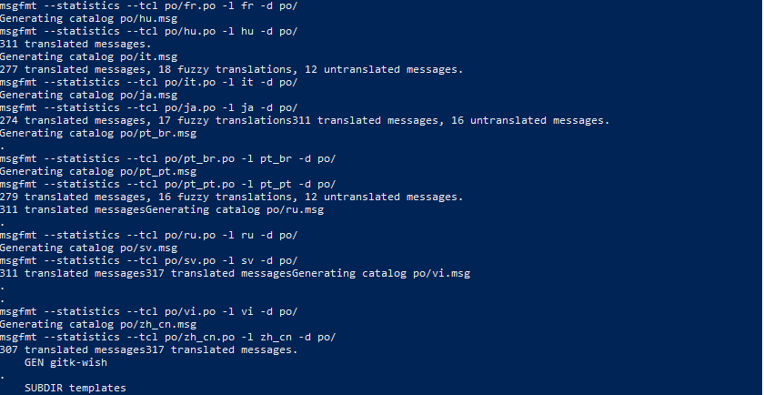
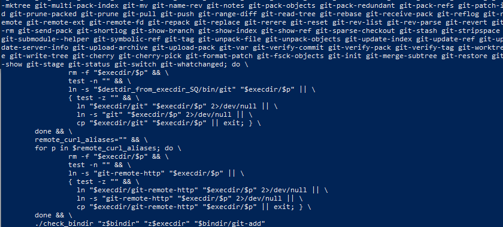
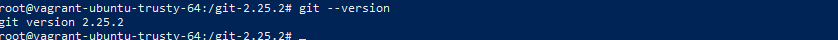

# 1. Getting Started
Git을 내 컴퓨터에 설치하고 처음 사용하는 방법에 대해 정리되어 있습니다.
<br/>
<br/>

# 2. 패키지 설치 명령어로 Git 설치하기
- CentOS에서 Git 설치 방법
  ``` bash
  yum install git -y
  ```
  

- Ubuntu에서 Git 설치 방법
  ``` bash
  apt install git -y
  ```
  
  
# 3. 소스 빌드하여 Git 설치하기
소스를 직접 빌드하여 설치하는 방법의 장점은 최신 버전의 Git을 사용할 수 있다는 장점이 있습니다. Yum 혹은 Apt 패키지 관리자 툴의 경우 관리자가 빌드하여 올린 패키지를 다운로드 받을 수 있기 때문에 버전이 구버전일 수 있습니다.

- [Git Mirrors](https://mirrors.edge.kernel.org/pub/software/scm/git/) 에서 원하는 최신 버전 다운로드
  ``` bash
  wget https://mirrors.edge.kernel.org/pub/software/scm/git/git-2.25.2.tar.gz
  ```
- 소스 파일 다운로드 후, 압축 해제 및 폴더 이동
  ``` bash
  ## 압축 해제
  tar -xvf git-2.25.2.tar.gz
  ## 압축 해제된 폴더로 이동
  cd git-2.25.2
  ``` 
  
- 소스 빌드를 위해 configure 명령 실행
  ``` bash
  ./configure
  ```
  

- Make 명령 실행하여 설치하기
  ``` bash
  ## make
  make -j4
  ## make install
  make install
  ```
  
  
  
- 설치된 git 버전 확인하기
  ``` bash
  git --version
  ```
  
