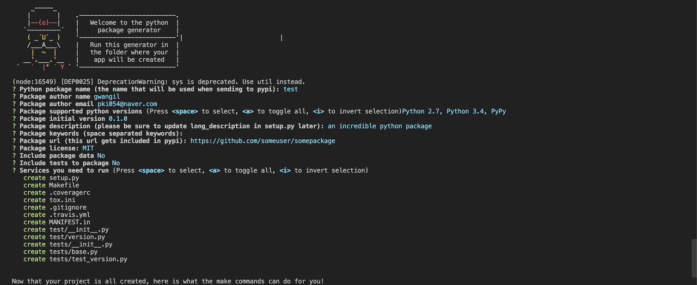

# 1. Getting Started
- Package Generator을 사용하여 패키지를 만드는 방법에 대해 정리하려고 한다. 
- 아쉽게도 파이썬에서 제공하는 Generator는 없는 듯하다. 그래서 누군가가 만들어준 Generator을 사용하여 패키지를 만드는 방법에 대해 정리해보겠다. (https://github.com/heynemann/generator-python-package)
<br/>

# 2. 구성 방법
- npm 패키지 매니저로 yo 패키지 설치
    - 명령어
        ```bash
        sudo npm install -g yo
        ```
    - 결과
        

- generator-python-package 설치
    - 명령어
        ```bash
        sudo npm install -g generator-python-package
        ```
    - 결과
        

# 3. 패키지 만들기
- 패키지는 yo 명령어로 이제 만들수 있다.
- 방법
    ```bash
    yo python-package
    ```
    
