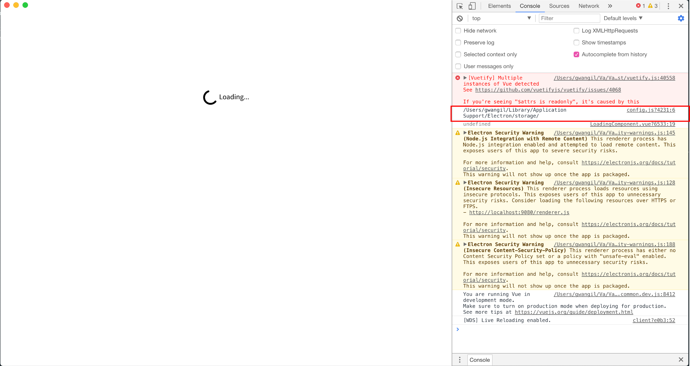

설정 파일 기능 사용하기
============   
* * *   

### 1. 필수 모듈 설치
``` bash
yarn add electron-json-storage
```


### 2. 시스템 애플리케이션 관련 파일 폴더 확인하기
각 OS마다 애플리케이션이 설치된 폴더와 사용하는 파일의 경로는 서로 분리되어있습니다. 
#### 2-1. config.js 코드 작성
config 파일을 조작하기 위해 스크립트를 별도로 작성해줍니다. ./src/scripts 폴더를 새로 만들어서 config.js 파일을 만들겠습니다.
- ./src/scripts/config.js
``` javascript
const storage = require('electron-json-storage')
var config = {}
const dataPath = `${storage.getDataPath()}/{프로그램 이름}`

config.getPath = function () {
  return dataPath
}

module.exports = config
```
{프로그램 이름}은 개발 중인 프로그램의 이름을 적어주면 됩니다.
#### 2-2. 프로그램 시작할 때, 경로 가지고 오도록 하기
electron-vue 툴을 사용하여 생성한 프로젝트는 LandingPage라는 컴포넌트가 먼저 실행됩니다. 해당 컴포넌트에 파일을 읽는 과정을 추가해보겠습니다.
- ./src/renderer/LandingPage.vue
``` javascript
import Config from '../../../scripts/config'

export default {
  created () {
    console.log(Config.getPath())
  }
}
```
#### 2-3. 프로그램 실행해보기
이제 프로그램 실행 시, 설정 파일 경로를 가지고 올 수 있는지 확인을 해봅시다. 콘솔 로그로 출력하도록 했기 때문에 개발자 콘솔로 들어간 후 결과를 확인해볼 수 있습니다.


### 3. 설정 파일에 데이터 쓰기
#### 3-1. 설정 파일에 데이터를 쓰는 방법
