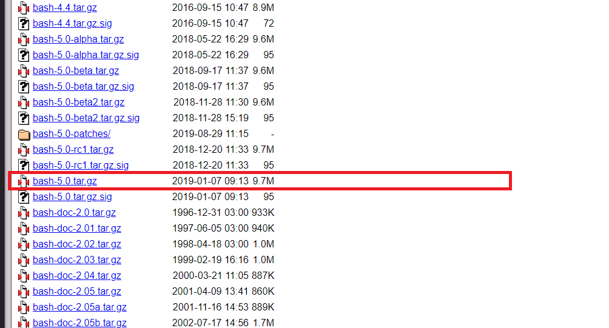

Bash 5.0 설치 방법
----------------------

Bash 5.0 버전이 2019-01-07 릴리즈가 되었습니다. CentOS 혹은 레드햇 계열의 OS에서는 기본적으로 낮은 버전의 패키지가 들어가 있습니다. 그래서 RPM 패키지는 없으며 설치하기 위해서는 직접 소스 빌드 과정을 해주어야 합니다. 그 과정에 대해 한번 알아보겠습니다.   

### 1. 배포되고 있는 FTP 서버 접속 후 다운로드

GNU에서 배포 중인 FTP 서버는 다음과 같습니다. 해당 FTP 서버에서 원하는 소스 파일을 다운로드 받습니다. 지금은 최신 버전 (v5.0)을 다운로드 받겠습니다. (http://ftp.gnu.org/gnu/bash)




### 2. 패치하고자 하는 서버에 옮긴 후 압축 해제
- 압축 해제 명령어
``` bash
tar -xvf bash-5.0.tar.gz
```
- 압축 해제된 폴더로 이동
``` bash
cd bash-5.0
```

### 3. 설치   
아래 과정을 순서대로 진행합니다. (소스 빌드 과정)
- configure
``` bash
./configure
```
빌드를 위해 configure 과정을 진행해줍니다. 시스템에 따라 문제가 발생할 수 있으며 문제 발생 시, 원인을 찾아 수정해주면 됩니다.


- make
``` bash
make
```

- make install
``` bash
make install
```

마지막 과정으로 빌드된 결과를 시스템에 설치하는 과정이다. 이것도 마찬가지로 무사히 넘어가면 성공이다.

### 4. 설치 결과 확인
- 접속 중인 쉘 종료 후, 접속 (재접속)
정상적으로 패치되었는지 확인을 위해 사용 중인 쉘을 종료 후 다시 접속한다.
- 설치된 bash 버전 확인
``` bash
bash --version
```


